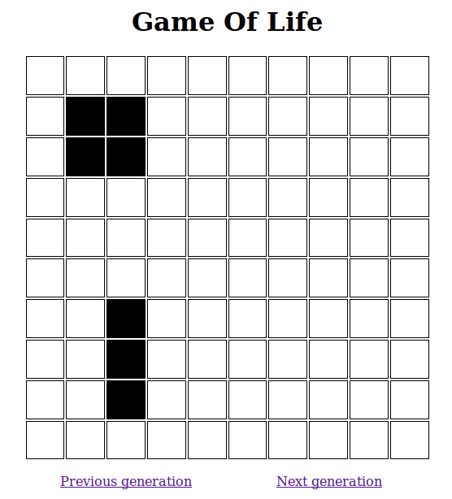

# Pure Java Game Of Life

This is an implementation of Conway's Game Of Life, a zero-player game featuring an infinite plane of square cells which evolve their state as alive or dead according to a finite set of rules:

- Any live cell with fewer than two live neighbours dies, as if caused by under-population.
- Any live cell with two or three live neighbours lives on to the next generation.
- Any live cell with more than three live neighbours dies, as if by over-population.
- Any dead cell with exactly three live neighbours becomes a live cell, as if by reproduction.



([Game Of Life on Wikipedia](https://en.wikipedia.org/wiki/Conway's_Game_of_Life))

The Game Of Life is a common kata to exercise in a code retreat, or to get your feet wet with a different technology. Keep the problem the same and change the conditions around it to cover new ground.

## Technologies used

This project tries to take a modern approach to Java software development, producing a self-contained application which embeds everything needed to run on any JVM in a development, CI or production environment. 

- Java 8 with lambdas support
- [Gradle](http://gradle.org/) for build automation and dependency resolution (substitutes both Ant and Maven)
- [Jetty](http://www.eclipse.org/jetty/) as an embedded server to respond to HTTP requests
- [Jersey](https://jersey.java.net/) for building the RESTful web service calculating new generations of a plane, using JAX-RS
- [Freemarker](http://freemarker.incubator.apache.org/) templating engine to build HTML
- [Log4j 2](http://logging.apache.org/log4j/2.x/) for logging, encapsulated behind the interface [slf4j](http://www.slf4j.org/).

On the testing side of things:

- [JUnit 4](http://junit.org/) for unit testing infrastructure
- [Mockito](http://mockito.org/) for Test Doubles
- [JUnit Quickcheck](https://github.com/pholser/junit-quickcheck) for property-based testing
- [Selenium](http://www.seleniumhq.org/) for browser-based testing


## How to run

Clone the project, then run:

```
./gradlew
```

The Gradle Wrapper will install itself.

Run

```
./gradlew test
```

to run unit, property-based and Selenium tests.


### Standalone

Then run

```
./gradlew installDist
cd build/install/game-of-life
bin/game-of-life
```

to install an instance in the build/ subfolder. Load [http://localhost:8080/planes/a-block-and-bar] in your browser to see the evolution of a test plane. The patterns featured in the sample are a stable block and a rotating bar, along with a lone cell vanishing after the first generation.

The plane shown is a configurable window of 10x10 cells having the plane origin as the top corner, but the underlying engine is capable of extending the plane dimensions automatically to use all available memory.

### Inside a server

```
./gradlew jettyRunWar
```

will spin up a Jetty server and deploy the WAR of the application inside it. The server can be terminated with CTRL-C and will serve requests with URLs such as [http://localhost:8080/game-of-life/planes/a-block-and-bar].
